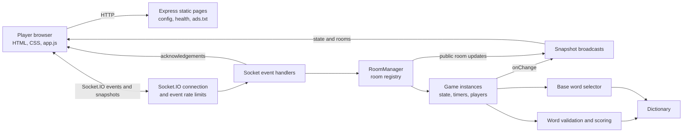

# Spliinter

A real-time multiplayer word game. Everyone in a room gets the same long word and two minutes to split it into as many shorter words as they can. Words that two or more players find cancel out; words only you found score. The best score each round wins a gold, silver or bronze medal.

Node.js + Socket.io on the server, plain HTML/CSS/JavaScript on the client. No database: all state lives in server memory.

The multiplayer app does not load advertising. Public editorial pages such as
`/how-to-play.html`, `/strategy.html`, `/faq.html`, and the articles under
`/guides/` are separate static pages and are listed in `public/sitemap.xml`.
Keep any future advertising limited to these substantive pages, never to the
room browser, lobby, round, results, or standings screens.

### Google Analytics

The site includes a consent-aware Google Analytics 4 tag for property
`G-6G16BK3GC0`. Analytics storage is denied until a visitor accepts optional
cookies. GA4 reports daily users and page views, and its Realtime report shows
active users. Custom events include room creation, room joins, game starts,
rematches, and accepted word submissions; usernames, room codes, and submitted
words are not sent.

## Run it locally

Requires Node.js 18 or newer.

```bash
npm install
npm start
```

Open http://localhost:3000 in two browser tabs. Each tab is its own player (the session is kept per tab), so you can test alone: pick a username in each tab, create a room in one, join it from the other with the room code, then press **Start game** as the host.

To play with other people on the same Wi-Fi, run the server on your machine and have them open `http://<your-local-IP>:3000`.

### Load test

Install dependencies, start the local server in one terminal, then run the load
test in a second terminal. By default it targets `http://127.0.0.1:3000`, opens
five Socket.IO clients, and sends concurrent requests to the homepage and
`/api/config` for 15 seconds.

```bash
npm start
# In another terminal:
npm run load-test -- --duration 15 --http-concurrency 5 --socket-clients 5
```

The report includes HTTP requests per second, status codes, p50/p95 latency,
Socket.IO connection latency, and room-list event acknowledgements. To probe the
60-per-IP-per-minute room-list limit, use a fresh local server process:

```bash
npm run load-test -- --duration 5 --http-concurrency 5 --socket-clients 5 --probe-event-limit
```

The probe sends extra read-only room-list subscriptions; it does not create
rooms or submit game words. Its results include any requests already counted in
the current fixed window, so restart the local server before a clean repeat.
The script refuses remote targets unless `--allow-remote` is provided, and then
caps the run at three HTTP workers, three sockets, and 30 seconds. Use that only
with a staging service you control, not production without an approved test
window. Local benchmark numbers describe your development machine, not expected
production capacity. See `npm run load-test -- --help` for options.

### Settings

```bash
# macOS / Linux
ROUND_SECONDS=20 INTERMISSION_SECONDS=8 npm start

# Windows PowerShell
$env:ROUND_SECONDS=20; $env:INTERMISSION_SECONDS=8; npm start
```

## Deploy with Render

The server uses Socket.IO and in-memory state, so it needs a long-running web
service. The included `render.yaml` deploys the Docker image as one Render web
service, which supports WebSockets without any additional proxy setup.

1. Push this repository to GitHub or GitLab.
2. In the Render dashboard, choose **New > Blueprint** and select the repository.
3. Confirm the `splinter` service from `render.yaml` and click **Apply**.

Render will build the included `Dockerfile`, set the `PORT` value used by
`server.js`, run the `/api/config` health check, and provide the public URL.
Keep the service at one instance because the lobby and scores live in process
memory. A deploy, restart, or sleeping free instance resets the current game.

| Variable | Default | Meaning |
| --- | --- | --- |
| `PORT` | `3000` | HTTP port |
| `ROUND_SECONDS` | `120` | Length of each round |
| `INTERMISSION_SECONDS` | `20` | Pause between rounds (the scoreboard popup and results screen) |
| `EMPTY_ROOM_SECONDS` | `45` | How long a room with nobody connected is kept before it is closed |
| `BASE_WORDS` | `random` | `random`: any suitable word from the full dictionary. `common`: a hand-picked list of about 90 everyday long words |
| `TRUST_PROXY_HOPS` | `0` | Number of trusted reverse proxies in front of the app. Set only when the deployment controls that proxy chain; the Render blueprint sets `1`. |

## Abuse limits

Socket.IO connections are limited to 30 per IP per minute. Per-IP event limits
are 5 room creations, 30 joins and leaves, 60 room-list subscriptions, 10 game
starts, 5 rematches, and 120 word submissions per minute. Rejected event
acknowledgements include a retry delay. Socket.IO payloads are capped at 16 KB.
Counters are in memory and shared across sockets on this process; they reset on
restart and are not shared across multiple instances. Keep one instance or move
the counters to shared storage before scaling horizontally.

These controls reduce abusive application traffic, but cannot stop a volumetric
DDoS attack from saturating the network or host. Use the hosting provider's
network protections and an edge firewall or DDoS-protected proxy for that.

## Rooms

- After choosing a username, a player lands on the **room browser**: a live list of public rooms, a "Create a room" form and a "Join with a code" box.
- **Creating a room:** optional name (2-24 characters, defaults to "<username>'s room"), max players (2-12, default 8) and whether it is listed publicly. The creator is the **host**.
- **Sharing:** every room has a 5-character code (no look-alike characters such as 0/O or 1/I) and an invite link, `/?room=CODE`. The address bar always shows the invite link while you are in a room. Opening one asks for a username, then joins straight away.
- **Public vs private:** public rooms appear in the browser (name, host, players, and whether they are waiting or in a game). Private rooms only join by code or link.
- **Host controls:** only the host can start a game, pick the number of rounds (1-10) and press Play again. If the host leaves or disconnects, the longest-present connected player becomes host.
- **Full or running rooms:** a new player can't join a room that is full or mid-game (the browser shows the button disabled). A player who dropped out of a running game can rejoin by using the same username.
- **Leaving:** the "Leave room" button returns to the browser. Empty rooms are closed after `EMPTY_ROOM_SECONDS`, so a page refresh never loses a room. The server keeps at most 200 rooms.
- Usernames are unique per room, not globally.

## Rules as implemented

- At least 2 players are needed to start.
- Each round uses one long word (9-12 letters), the same for everyone in the room, with a server-enforced countdown. Words don't repeat within a game.
- The server validates every submission: at least 3 letters, not the base word, only letters from the base word and no letter more often than the base word has it, and present in the dictionary.
- At the end of a round, a word found by 2+ players scores 0 for everyone; each word found by exactly one player scores 1 point. Other players' words stay hidden until the round ends.
- **Medals:** the top round score wins gold, then silver and bronze. Ties share a medal and skip the next one (two golds means no silver). A score of 0 never earns a medal.
- **Scoreboard popup:** after every round a popup shows the standings before the round, then the points being added and the rows sliding up or down into their new places. It closes on its own when the next round starts, or with the button, Escape or a click outside.
- Totals accumulate across rounds. After the last round the highest total wins (equal totals are a tie), and the final table shows each player's medal counts.
- "Play again" returns the room to its lobby with scores reset.

## Dictionary and round words

Words come from the [`word-list`](https://www.npmjs.com/package/word-list) package (274,137 words, MIT licensed). It is ESM-only, so `lib/dictionary.js` loads it with a dynamic `import()`, reads it once into a `Set` for validation, and keeps the array for picking words.

In `random` mode, each round's word is drawn at random from the dictionary's 9-12 letter words, skipping plain inflections (plurals, -ed, -ing, -ly and similar) and words that hide fewer than 120 other valid words. The word list is a Scrabble-style list, so some random picks are obscure. If that isn't fun, start with `BASE_WORDS=common`.

## Project layout

```
server.js          Express static server + Socket.io event wiring (rooms, lobby, game events)
lib/rooms.js       RoomManager: creates rooms and codes, lists public rooms, closes empty ones
lib/game.js        One room's state machine: players, host, phases, timers, medals, snapshots
lib/rules.js       Pure functions: word validation, round scoring, medals
lib/dictionary.js  Loads word-list into memory
lib/baseWords.js   Picks the random (or common) base word for each round
public/            index.html, style.css, app.js (client), editorial and policy pages
```

## High-Level Design (HLD)

### System context

Spliinter is a browser-based multiplayer word game. The browser renders the
interface and sends player actions to one authoritative Node.js process. The
server owns room membership, game state, timers, word validation, and scoring;
clients receive snapshots and render them. There is no account system, database,
or persistent game history.



### Deployment and boundaries

- The application runs as one long-lived Node.js process in the supplied Docker image. Render is configured for one instance because rooms, rate-limit buckets, and timers are process-local.
- Express serves the files in `public/`, `/api/config`, `/healthz`, and `/ads.txt`. Socket.IO provides the real-time game protocol over WebSocket or its transport fallback.
- The dictionary is loaded from the `word-list` dependency during startup. The process prepares base-word lookup data before accepting traffic.
- All game state is volatile. A process restart clears rooms, players, timers, and rate-limit counters. There is no database or cross-instance synchronization.
- Socket connections and actions have per-IP fixed-window limits. The client IP comes from the socket transport address unless `TRUST_PROXY_HOPS` is configured for a trusted deployment proxy. These limits protect application work, not the network from volumetric DDoS traffic.
- Since the app is authoritative, clients cannot set scores, bypass validation, change timers, or see other players' words before a round ends.

## Low-Level Design (LLD)

### Components and ownership

| Component | Responsibilities |
| --- | --- |
| `server.js` | Creates Express and Socket.IO, serves static/health/config/ads endpoints, loads startup data, applies connection and event limits, dispatches events, and sends room/player snapshots. |
| `lib/rooms.js` (`RoomManager`) | Creates and looks up rooms, generates room codes, validates room capacity, lists public rooms, and closes rooms after they remain empty. |
| `lib/game.js` (`Game`) | Owns one room's players, host, phase, round timer, base words, submissions, scores, medals, reconnect behavior, and per-player snapshots. |
| `lib/rules.js` | Pure word-validation, round-scoring, and medal-ranking functions. |
| `lib/dictionary.js` | Loads the word-list package once and exposes dictionary membership and the word array. |
| `lib/baseWords.js` | Prepares candidate word indexes and selects distinct round words from either the full dictionary or the common-word pool. |
| `lib/fixedWindowRateLimiter.js` | Tracks per-key request counts in fixed 60-second windows and bounds the number of stored keys. |
| `public/app.js` | Handles username/session state, room navigation, Socket.IO requests, incoming snapshots, and DOM rendering. It is not authoritative for rules or scores. |

### Runtime and game-state flow

1. Startup loads the dictionary, prepares base-word candidates, then starts the HTTP and Socket.IO server.
2. A Socket.IO connection passes the per-IP connection limit. Each handled event passes its own per-IP event limit before its handler runs.
3. A player creates or joins a room. `RoomManager` resolves the room and delegates membership changes to its `Game`. The game issues an opaque reconnect token and emits a change notification.
4. The server sends each connected player a tailored state snapshot. The public room list is broadcast separately and its change notifications are batched for up to 300 ms.
5. The host starts the game. `Game` chooses round words, enters `playing`, sets `endsAt`, and schedules the server-side round timer.
6. A `submit` event is validated by `Game` and `validateWord`. Accepted words are stored in that player's set and a new state snapshot is broadcast. Other players see the word count, not the submitted words.
7. At round end, the server scores all submissions, cancels words found by multiple players, awards medals, and publishes the result. It either schedules the next round or enters `gameOver`.
8. A host rematch resets scores and returns connected players to the lobby. Rooms with no connected players are removed after `EMPTY_ROOM_SECONDS`.

The game phase sequence is:

```text
lobby -> playing -> roundEnd -> playing ... -> gameOver -> lobby
```

Round and intermission timers run on the server. Snapshots include `serverNow`,
`endsAt`, and `nextRoundAt` so browsers can render countdowns against server
time. A submission received after the round deadline is rejected.

### Socket.IO contract

Client events use acknowledgement callbacks for immediate results. Successful
room entry returns `{ ok, code, token, username }`; failures return an error or
reason. A rate-limited event returns `{ ok: false, code: "RATE_LIMITED",
retryAfter, error, reason }` when the client supplied an acknowledgement.

| Client event | Purpose | Typical payload |
| --- | --- | --- |
| `rooms:subscribe` | Subscribe to public-room updates and retrieve the current list. | `{}` |
| `createRoom` | Create a room and join as its host. | `{ username, name?, maxPlayers, isPublic }` |
| `joinRoom` | Join or reconnect to a room. | `{ code, username, token? }` |
| `leaveRoom` | Leave the current room and return to room browsing. | `{}` |
| `start` | Start a game as the host. | `{ rounds }` |
| `submit` | Submit a word during the active round. | `{ word }` |
| `playAgain` | Reset a completed game as the host. | `{}` |

Server push events are `state` (a player-specific room/game snapshot) and
`rooms` (the public room list). Player snapshots include that player's own words;
other submissions are only included in the result after a round ends.

### State and validation rules

- `RoomManager.rooms` maps room codes to `Game` instances. Each game's `players` map is keyed by an opaque token; player records hold connection state, score totals, round scores, medals, and current-round words.
- The room host is the earliest connected player selected by `Game.ensureHost()`. Only the host can start a game, choose the round count, or request a rematch.
- `Game` enforces phase transitions and timer deadlines. `rules.js` enforces word syntax, minimum length, base-word exclusion, letter counts, and dictionary membership. Scores and medals are calculated server-side.
- A reconnect token is stored in the browser's per-tab `sessionStorage` and is only useful while the matching in-memory game still exists. Disconnected players are removed from a lobby, but retained during a running game; their submitted words still count toward scoring and duplicate cancellation.
- `RoomManager` caps the process at 200 rooms; rooms have a player cap of 2-12. Empty rooms receive a close timer that is cancelled if a player reconnects.

### Rate-limit policy

`server.js` keys each 60-second fixed window by the resolved client IP and action.
The current limits are 30 Socket.IO connections, 5 room creations, 30 joins,
30 leaves, 60 room-list subscriptions, 10 game starts, 5 rematches, and 120 word
submissions per IP per minute. Rejected event acknowledgements include a
`retryAfter` value. The limiter stores at most 20,000 keys; when full it removes
expired buckets and rejects new keys if capacity is still exhausted. The
counters are local to one process and are not a substitute for edge/network
DDoS protection.

## Putting it online

Any host that runs a long-lived Node process with WebSocket support works (a VPS, Render, Railway, Fly.io and similar). Set `PORT` if the host asks for it; `/healthz` returns `ok` for health checks.

- **Run a single instance.** All rooms live in one process's memory. A restart ends every game, and several instances would need shared state and sticky sessions.
- **Public names are user-generated.** Usernames and room names are shown to strangers. There is no profanity filter, moderation, or account system. The server applies per-IP Socket.IO connection and event limits, plus a room cap; these do not replace hosting-provider or edge DDoS protection.
